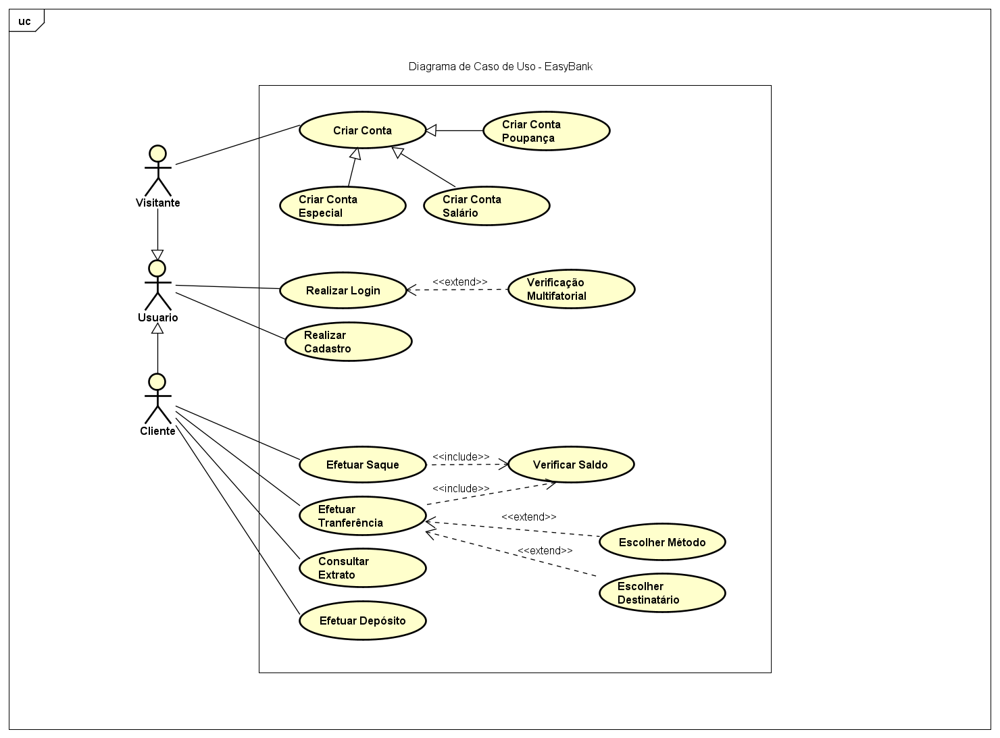
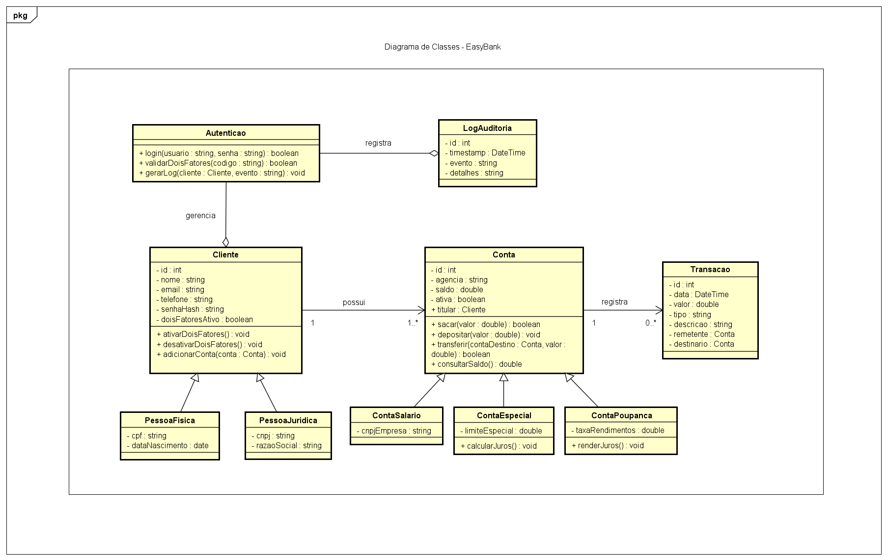

# 💳 EasyBank

Projeto final da matéria de Modelagens de Sistemas Computacionais, visando o protótipo de um sistema bancário digital moderno, seguro e escalável.

---

## 📁 Estrutura do Repositório

- **UseCase/**  
  Contém o diagrama de caso de uso geral da aplicação.

- **ClassDiagram/**  
  Contém o diagrama de classes da aplicação.

- **Figma/**  
  Protótipos de interface criados no Figma, com foco em uma navegação intuitiva e responsiva para o usuário final.

- **DomainModel/**  
  Representação conceitual do domínio do sistema, mapeando os principais objetos, atributos e relações de negócio.

---

## Caso de Uso

---

## Modelo de Domínio

---

## Diagrama de Classes

---

## Protótipo - Figma

[Clique aqui para ver o protótipo em PDF.](Figma/EasyBank%20-%20Telas.pdf)

---

## 👨‍💻 Autor

**Guilherme Tuchanski Rocha**

---

